# Dependency manager CLI

## Description
This project is a command-line interface (CLI) application built with Node.js to manage project dependencies. It simulates how package managers track and organize code by acting as an intuitive wrapper around npm. It allows developers to easily initialize projects, track installed packages, add new libraries, and keep their codebase up-to-date through a unified terminal tool.

## Features and Usage
- **Initialize a new project:** Either select an option using the inquire command line
    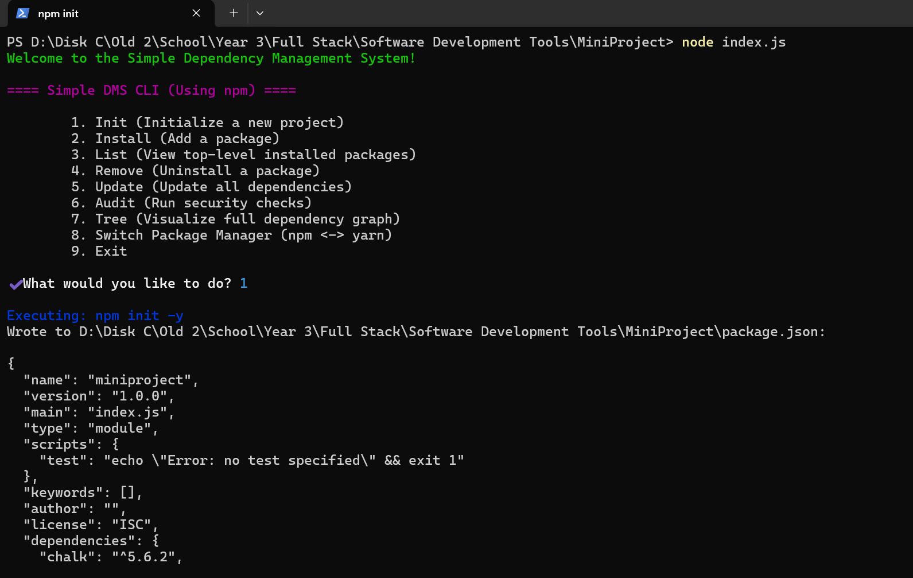

    Or use the command

    ```bash
    node index.js init
    ```
    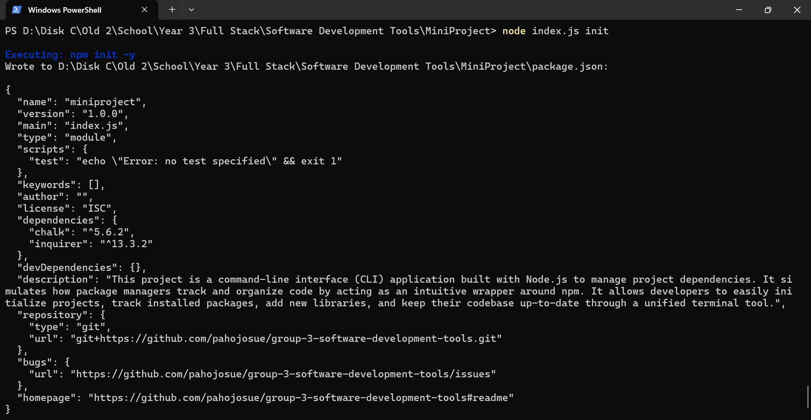

- **Install Packages:** Quickly add new dependencies to your project. The CLI securely fetches the requested package and updates your `package.json` and `node_modules` automatically.

    Either select an option using the inquire command line
    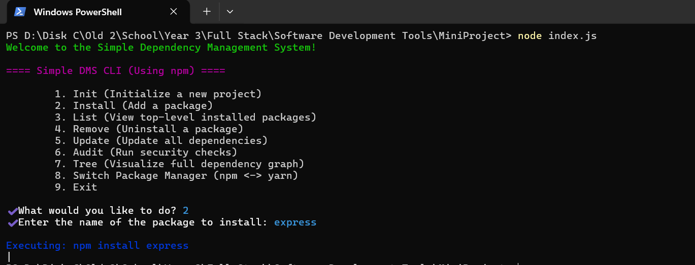
    Or use the command

    ```bash
    node index.js install <package_name>
    ```
    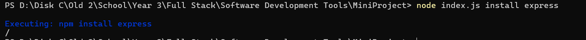

- **Remove packages:** Clean up your project by safely uninstalling unused or deprecated packages, ensuring they are entirely removed from your dependency tree.

    Either select an option using the inquire command line
    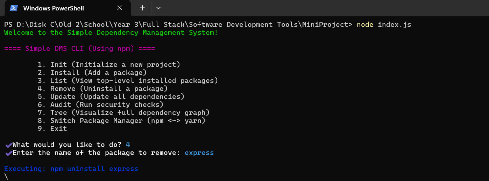
    Or use the command

    ```bash
    node index.js remove <package_name>
    ```
    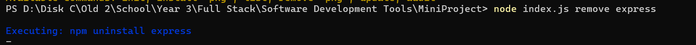

- **List dependencies:** Output a clear, easy-to-read list of all top-level packages currently installed, helping you understand exactly what your project relies on.

    Either select an option using the inquire command line
    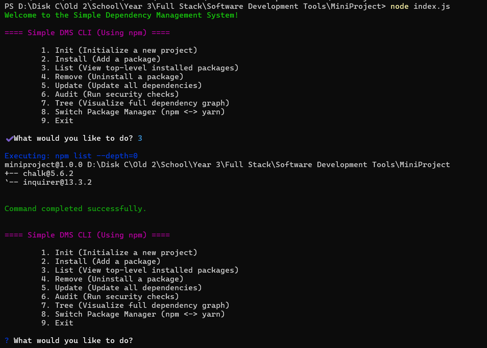
    Or use the command

    ```bash
    node index.js remove list --depth0
    ```
    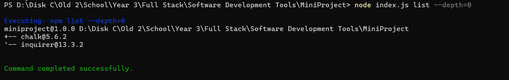

- **Update packages:** Keep your code secure and modern by checking for and applying updates to all your installed dependencies with a single command.

    Either select an option using the inquire command line
    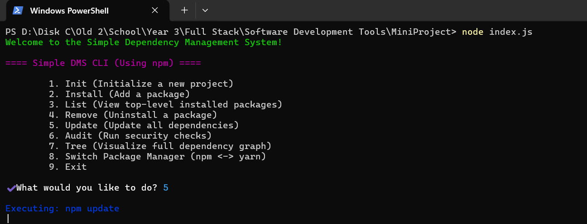
    Or use the command

    ```bash
    node index.js update
    ```
    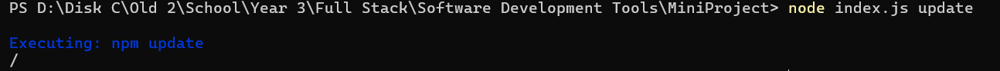

- **Audit packages:** Either select an option using the inquire command line
    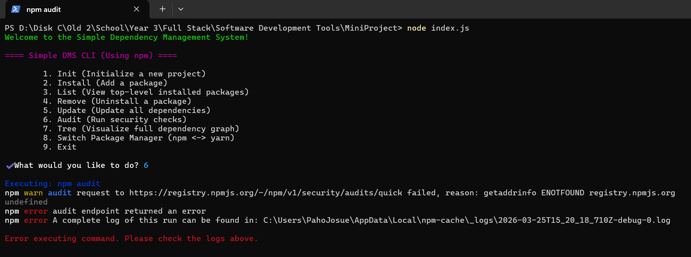
    Or use the command

    ```bash
    node index.js audit
    ```
    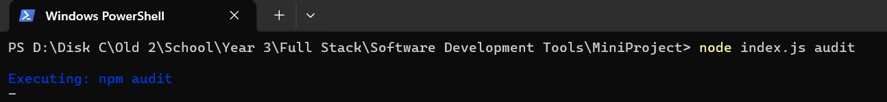

- **Generate Graph:** Select an option using the inquire command line
    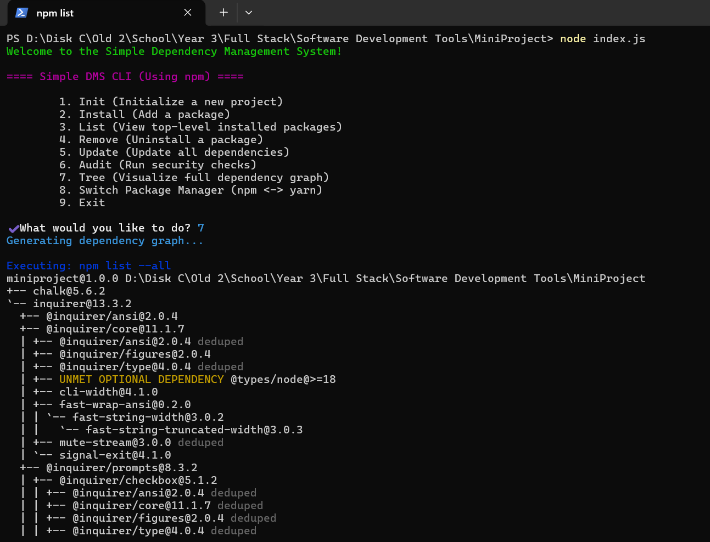

- **Switch Package Manager:** Select an option using the inquire command line
    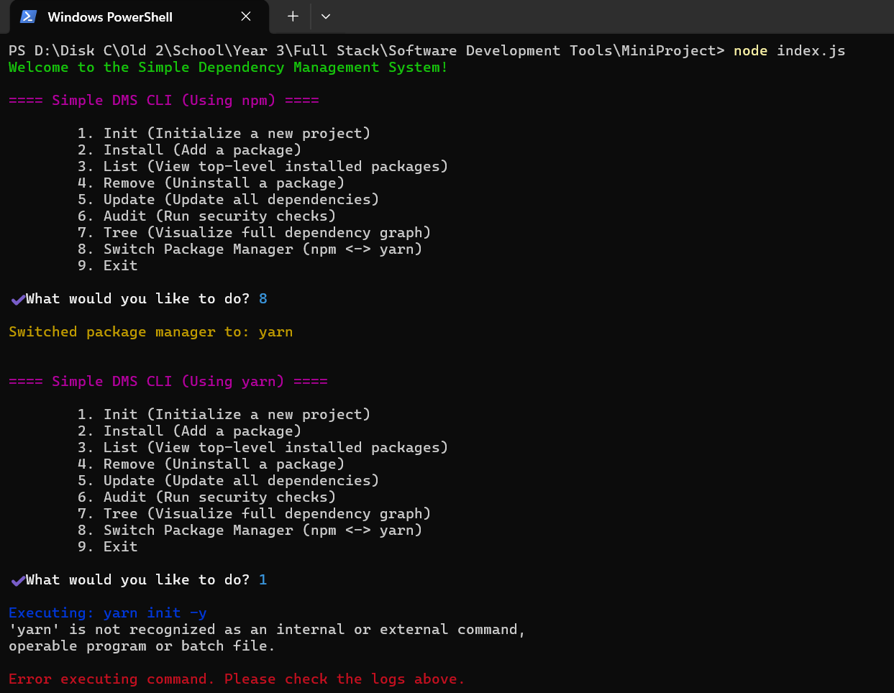

## Group Members
- **PAHO TCHAPTCHET JOSUE SHEKINA (DIRECT-ENTRY)**
- **FEUNOU FORTIA ASANGWE(TOP-UP)**
- **MAHIMWA DJODJOUNG CYBILE MANUELA(TOP-UP)**
- **DARELL AWUZU OZIOMA OZOKWERE(TOP-UP)**
- **PADZEU NTIEWE BELLAMY(TOP-UP)**
- **MOSHOM TAGNE JULIETTE AURELIE(TOP-UP)**
