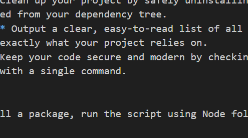

# Dependency manager CLI

## Description
This project is a command-line interface (CLI) application built with Node.js to manage project dependencies. It simulates how package managers track and organize code by acting as an intuitive wrapper around npm. It allows developers to easily initialize projects, track installed packages, add new libraries, and keep their codebase up-to-date through a unified terminal tool.

# Features
- **Install Packages:** Quickly add new dependencies to your project. The CLI securely fetches the requested package and updates your `package.json` and `node_modules` automatically.
- **Remove packages:** Clean up your project by safely uninstalling unused or deprecated packages, ensuring they are entirely removed from your dependency tree.
- **List dependencies:** Output a clear, easy-to-read list of all top-level packages currently installed, helping you understand exactly what your project relies on.
- **Update packages:** Keep your code secure and modern by checking for and applying updates to all your installed dependencies with a single command.

## Usage
To use the CLI to install a package, run the script using Node followed by your desired command and package name:



```bash
node index.js install express